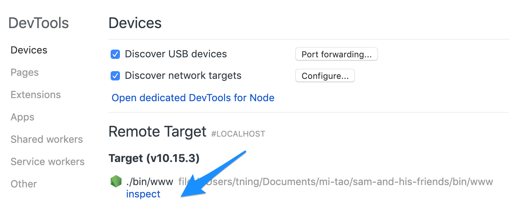

# Sam And His Friends

## How to run in dev

1. Checkout source code: `$ git clone git@github.com:tningjs/sam-and-his-friends.git`
2. Install dependency: `$ yarn install`
3. Start server: `$ npm start`
4. visit https://localhost/

## How to debug

1. `$: npm run debug`
2. Open Chrome, navigate to `chrome://inspect/#devices`
3. Click "Inspect" in the Remote Target section. **Notice:** Cick the Node debug icon or click "Open dedicated DevTools for Node" not work for [some version](https://github.com/nodejs/node/issues/23693#issuecomment-440623410). This step should pause the process in the first line, click continue in the debug tool
4. Open anther tab, go to `localhost:3000`, this step should pause the programm in the `debugger` you put in the code.

In the production server, can use `$ pm2 logs` to see the logs.

## How to run in production

1. Checkout source code: `$ git clone git@github.com:tningjs/sam-and-his-friends.git`
2. Install dependency: `$ yarn install`
3. Build: `$ npm run build`
4. Install process manager: `$ sudo npm install -g pm2`
5. CD into repository: `$ cd sam-and-his-friends`
6. Start server: `$ NODE_ENV=production pm2 start ./server.js`

### How to deploy a new version production

1. The list of applications currently managed by PM2 can also be looked up with the list subcommand:

`$ pm2 list`

2. Stop an application with this command (specify the PM2 App name or id):

`$ pm2 stop app_name_or_id`

3. Update dependency

`$ cd sam-and-his-friends && git pull && yarn install && npm run build`

4. Start application again

`$ NODE_ENV=production pm2 start ./server.js`

## Change log

The change log can be found on the [Releases page](https://github.com/tningjs/sam-and-his-friends/releases).

## Contributing

Everyone is welcome to contribute. Please take a moment to review the [contributing guidelines](Contributing.md).

## Authors and license

[Tao Ning](https://github.com/tningjs/sam-and-his-friends) and [contributors](https://github.com/tningjs/sam-and-his-friends/graphs/contributors).

MIT License, see the included [License.md](License.md) file.
